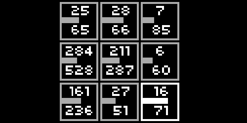

# automs70
This is a [monome norns](https://monome.org/norns/) script  to automate up to nine parameters of the ZOOM MS-70 CDR multi effect.

# how to use automs70
Use the encoder 1 to select one of the nine controllers.   
The encoder 2 sets the minimum value and encoder 3 sets the maximum value that will be sent to the MS-70 CDR.  
Pressing key 2 you can select the effect and knob destination.  
Use key 3 to randomize the values.  
Automs70 can also be used to generate nine MIDI control change commands: define in the norns parameters menu the destination CC number and relative midi channel. 

